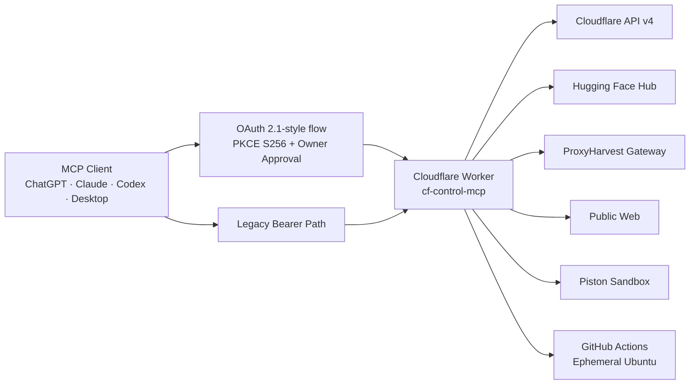

<div align="center">


# cf-control-mcp

### Private infrastructure control plane for MCP clients

**Cloudflare Workers · OAuth + PKCE · Cloudflare · Hugging Face · ProxyHarvest · Web · Sandboxed Execution**

[](./package.json)
[](https://workers.cloudflare.com/)
[](https://modelcontextprotocol.io/)
[](#authentication--oauth)
[](./src)

<br />

> **A private remote MCP server that turns a Cloudflare Worker into an authenticated control surface for infrastructure, provider APIs, web access, and controlled code execution.**

[Production MCP](https://cf-control-mcp.amin-chinisaz-edu.workers.dev/mcp) · [Source](./src) · [OAuth Wrapper](./src/oauth-worker.ts) · [Plugin](./plugins/cf-control) · [Verification](./scripts/oauth_smoke.py)

<br />

**Developed by DreamWorker**  
*THE FUTURE IS CREATED TODAY*

</div>

---

## ✦ What this project is

`cf-control-mcp` is a **private, owner-approved remote MCP server** deployed on Cloudflare Workers. It exposes a single MCP endpoint that can inspect and manage Cloudflare resources, work with Hugging Face repositories, inspect ProxyHarvest gateway reachability, fetch/search the public web, run short-lived code in Piston, and dispatch real ephemeral Ubuntu jobs through GitHub Actions.

The server is intentionally stateless at the MCP transport layer: one authenticated HTTP request produces one JSON-RPC response, without requiring Durable Objects or a long-lived SSE session.

```text
MCP Client
   │
   │  OAuth + PKCE  /  legacy bearer
   ▼
Cloudflare Worker ───────────────► Cloudflare API
   │                              Hugging Face Hub API
   │                              ProxyHarvest Gateway
   │                              Public Web
   │                              Piston Sandbox
   └─────────────────────────────► GitHub Actions Ubuntu Runner
```

---

## ✦ Capability map

| Surface | What it provides | Representative tools |
|---|---|---|
| ☁️ **Cloudflare** | Zones, DNS, cache, Workers, routes, KV, token verification, direct API passthrough | `cf_list_zones`, `cf_list_dns_records`, `cf_purge_cache`, `cf_list_workers`, `cf_deploy_worker_module`, `cf_api_request` |
| 🤗 **Hugging Face** | Identity, model search, repo metadata, file commits/deletes, generic Hub API access | `hf_whoami`, `hf_search_models`, `hf_repo_info`, `hf_commit_file`, `hf_api_request` |
| 🌐 **Web** | Public HTTP fetches plus keyless DuckDuckGo HTML search | `web_fetch`, `web_search` |
| ⚙️ **Execution** | Fast Piston snippets and full ephemeral GitHub Actions Ubuntu runners | `run_code`, `list_code_runtimes`, `gh_run_code`, `gh_get_run_result` |
| 🛰️ **ProxyHarvest** | Gateway health, source reachability, TCP/TLS transport reachability | `proxyharvest_gateway_health`, `proxyharvest_source_check`, `proxyharvest_transport_probe` |
| 🔐 **Auth** | OAuth discovery, DCR, PKCE S256, owner approval, access/refresh tokens, legacy bearer | `/.well-known/*`, `/register`, `/authorize`, `/token`, `/mcp` |

> **Boundary:** ProxyHarvest Cloudflare checks are **reachability signals only**. They are never tunnel/protocol/WireGuard verification. Real `VERIFIED` status remains exclusive to the Local Real Test Bridge using `sing-box + curl`.

---

## ✦ Architecture



### Design principles

- **Private by default** — `/mcp` requires an accepted OAuth access token or the legacy owner bearer token.
- **Provider secrets stay server-side** — Cloudflare, Hugging Face, and GitHub credentials remain Worker secrets.
- **Read first, write deliberately** — focused destructive tools expose destructive annotations and, where implemented, require explicit confirmation flags.
- **No fake verification** — reachability, deployment, and execution claims are returned from the actual provider/tool path.
- **Stateless transport** — simple Streamable HTTP JSON-RPC without per-client server sessions.

---

## ✦ Authentication & OAuth

There are two credential layers:

| Layer | Credential | Purpose |
|---|---|---|
| **Client → MCP Worker** | OAuth access token or `MCP_AUTH_TOKEN` | Protects access to the MCP control surface |
| **MCP Worker → Providers** | `CLOUDFLARE_API_TOKEN`, optional `HUGGINGFACE_TOKEN`, optional `GITHUB_PAT` | Authenticates server-side provider calls |

The OAuth wrapper supports:

- protected-resource discovery
- authorization-server discovery
- Dynamic Client Registration
- Authorization Code flow
- PKCE with `S256`
- explicit owner approval page
- access tokens
- refresh tokens through `offline_access`
- OAuth resource/audience binding
- legacy owner-token compatibility

### OAuth endpoints

| Endpoint | Purpose |
|---|---|
| `/.well-known/oauth-protected-resource` | Protected-resource metadata |
| `/.well-known/oauth-authorization-server` | Authorization-server metadata |
| `/register` | Dynamic client registration |
| `/authorize` | PKCE authorization + owner approval |
| `/token` | Authorization-code / refresh-token exchange |
| `/mcp` | Streamable HTTP MCP endpoint |

### Current authorization behavior

After the owner explicitly approves an OAuth client, the current implementation exposes the **same owner-approved tool catalog** as the legacy bearer path. This includes tools capable of writes and destructive operations.

The advertised OAuth scopes are currently:

```text
mcp:read
offline_access
```

`offline_access` enables refresh tokens. The current implementation does **not** use separate fine-grained OAuth scopes to hide individual write-capable tools after owner approval.

> Generic passthrough tools such as `cf_api_request` and `hf_api_request` should be treated as privileged interfaces because their effective power follows the underlying provider token permissions.

### Emergency revocation

Rotating `MCP_AUTH_TOKEN` invalidates the stateless client-side authorization artifacts derived from it, including registered client IDs, authorization codes, access tokens, refresh tokens, and the legacy bearer credential.

---

## ✦ Quick start

### 1. Install

```bash
npm install
wrangler login
```

### 2. Configure required Worker secrets

```bash
openssl rand -hex 32
wrangler secret put MCP_AUTH_TOKEN
wrangler secret put CLOUDFLARE_API_TOKEN
wrangler secret put CLOUDFLARE_ACCOUNT_ID
```

### 3. Optional provider integrations

```bash
# Hugging Face control tools
wrangler secret put HUGGINGFACE_TOKEN

# GitHub Actions real-runner execution
wrangler secret put GITHUB_PAT

# Optional; defaults to nimazasinich/cf-control-mcp
wrangler secret put GITHUB_REPO
```

### 4. Deploy

```bash
npm run deploy
```

Production endpoint:

```text
https://cf-control-mcp.amin-chinisaz-edu.workers.dev/mcp
```

---

## ✦ Connecting an MCP client

The repository includes a direct MCP configuration at:

```text
plugins/cf-control/.mcp.json
```

It points to the production endpoint:

```json
{
  "mcpServers": {
    "cf_control": {
      "type": "http",
      "url": "https://cf-control-mcp.amin-chinisaz-edu.workers.dev/mcp"
    }
  }
}
```

OAuth-capable clients can discover the authorization server from the `401` challenge and the `.well-known` metadata, dynamically register, complete PKCE, and continue with access/refresh tokens after owner approval.

Trusted legacy/desktop clients may use the owner bearer path directly:

```bash
curl -X POST \
  https://cf-control-mcp.amin-chinisaz-edu.workers.dev/mcp \
  -H "Authorization: Bearer <MCP_AUTH_TOKEN>" \
  -H "Content-Type: application/json" \
  -d '{"jsonrpc":"2.0","id":1,"method":"tools/list"}'
```

---

## ✦ Cloudflare control surface

### Focused operations

| Tool | Purpose | Type |
|---|---|---|
| `cf_verify_api_token` | Verify the configured Cloudflare token | Read |
| `cf_list_zones` | List/filter zones | Read |
| `cf_list_dns_records` | Inspect DNS records | Read |
| `cf_create_dns_record` | Create DNS record | Write |
| `cf_delete_dns_record` | Delete DNS record | Destructive |
| `cf_purge_cache` | Purge selected URLs or entire zone cache | Destructive |
| `cf_list_workers` | List deployed Worker scripts | Read |
| `cf_get_worker_metadata` | Inspect Worker/service metadata | Read |
| `cf_get_workers_subdomain` | Resolve the workers.dev subdomain | Read |
| `cf_list_worker_routes` | Inspect Worker routes for a zone | Read |
| `cf_deploy_worker_module` | Deploy a single-module ES Worker | Destructive / Write |
| `cf_delete_worker` | Delete Worker script | Destructive |
| `cf_kv_list_namespaces` | List KV namespaces | Read |
| `cf_kv_get_value` | Read KV value | Read |
| `cf_kv_put_value` | Write KV value | Write |
| `cf_api_request` | Generic Cloudflare API v4 passthrough | Privileged |

`cf_deploy_worker_module` sends source directly to Cloudflare, does not persist that source inside the MCP Worker, validates script/module names, caps source size, and requires `confirm_destructive=true`.

`cf_api_request` exists for Cloudflare APIs that do not yet have focused tools, including areas such as zone settings, SSL/TLS, WAF/firewall, Access, R2, D1, Pages, Stream, Images, Load Balancing, and other account/zone endpoints allowed by the configured Cloudflare token.

---

## ✦ Hugging Face control surface

Enable with:

```bash
wrangler secret put HUGGINGFACE_TOKEN
```

| Tool | Purpose |
|---|---|
| `hf_whoami` | Verify token and return account metadata |
| `hf_search_models` | Search public or author-filtered models |
| `hf_repo_info` | Read model/dataset/space metadata |
| `hf_list_repo_files` | List repo tree at a revision |
| `hf_create_repo` | Create model/dataset/space repo |
| `hf_delete_repo` | Delete a repo |
| `hf_commit_file` | Create/update one non-LFS file through the Commit API |
| `hf_delete_file` | Delete a repo file through the Commit API |
| `hf_api_request` | Generic Hugging Face Hub API passthrough |

If `HUGGINGFACE_TOKEN` is not configured, `hf_*` tools return an explicit configuration error instead of silently falling back.

---

## ✦ Web & execution tools

### Public web

`web_fetch` provides outbound public HTTP/HTTPS access with custom method, headers, request body, and response-size control.

It blocks obvious localhost/private/link-local/metadata destinations and caps returned body size. `web_search` performs keyless DuckDuckGo HTML search and is intentionally treated as a best-effort search surface because markup/rate limits are outside this project’s control.

### Fast sandbox: Piston

`run_code` sends short snippets to the public Piston service and returns execution output. Use `list_code_runtimes` to discover currently available runtime versions.

This path is:

- ephemeral
- stateless
- external to the Cloudflare account
- not suitable for secrets or private data

### Real runner: GitHub Actions

`gh_run_code` dispatches `.github/workflows/mcp-exec.yml` and returns a `run_key`.

`gh_get_run_result` polls that key until the Actions run is visible/completed, then returns status and job logs.

The runner is a real ephemeral Ubuntu VM with internet access and can run optional setup commands such as `pip install`, `npm install`, or `apt` operations within the workflow’s limits.

Required Worker secret:

```bash
wrangler secret put GITHUB_PAT
```

The token should be scoped to the target repository with the permissions required by the workflow dispatch/read path.

---

## ✦ ProxyHarvest boundary

The three ProxyHarvest tools are intentionally read-only:

| Tool | Meaning |
|---|---|
| `proxyharvest_gateway_health` | Gateway / edge / optional AI-provider health |
| `proxyharvest_source_check` | Public source reachability |
| `proxyharvest_transport_probe` | TCP/TLS transport reachability |

They explicitly return classifications that distinguish gateway/source/transport reachability from real proxy verification.

**Reachable ≠ Verified.**

---

## ✦ Verification

### Local static checks

```bash
npm ci
npx tsc --noEmit
python3 -m py_compile scripts/oauth_smoke.py scripts/apex_cf_bridge.py
```

### Live OAuth/MCP smoke test

The deployment workflow executes `scripts/oauth_smoke.py` against the live Worker. The current smoke test validates:

- protected-resource discovery
- authorization-server discovery
- Dynamic Client Registration
- PKCE `S256`
- owner approval UI
- authorization-code exchange
- access + refresh tokens
- OAuth `tools/list`
- presence of the owner-approved write-capable catalog
- a harmless `GET /zones` through `cf_api_request` using OAuth
- refresh-token grant
- legacy bearer compatibility
- optional Hugging Face live check
- unauthenticated `401` + `WWW-Authenticate` resource metadata

The smoke test does not print the owner secret or issued OAuth tokens.

---

## ✦ Repository layout

```text
.
├── src/
│   ├── index.ts              # MCP server + tool handlers
│   └── oauth-worker.ts       # OAuth discovery, PKCE, tokens, MCP wrapper
├── scripts/
│   └── oauth_smoke.py        # live end-to-end OAuth/MCP verification
├── plugins/cf-control/
│   ├── .mcp.json             # remote MCP connection descriptor
│   └── skills/               # OpenAI/Codex skill package
├── .github/workflows/
│   ├── ci.yml                # static verification
│   ├── deploy.yml            # deploy + live smoke verification
│   └── mcp-exec.yml          # ephemeral real-runner execution backend
├── assets/
│   └── dreamworker-logo.webp # DreamWorker developer brand
├── wrangler.jsonc
├── package.json
└── README.md
```

---

## ✦ Operational notes

- Keep all provider credentials in Worker/GitHub secret stores, never in source control.
- Scope `CLOUDFLARE_API_TOKEN` to the minimum provider permissions needed for the enabled tools.
- Treat generic API passthroughs as privileged interfaces.
- Treat `gh_run_code` as intentional arbitrary code execution on disposable Actions runners.
- Treat Piston as a public third-party sandbox; never send secrets through it.
- Verify state after writes using focused read tools when practical.
- Workers observability remains enabled through `wrangler.jsonc`.

---

## ✦ Roadmap direction

The current `1.5.0` architecture already behaves as a multi-provider infrastructure MCP gateway. Natural next upgrades include:

- fine-grained OAuth scopes per capability family
- schema-first argument validation
- provider-aware pagination helpers
- rate limiting / abuse controls
- structured audit events
- safer generic passthrough policies
- richer MCP resources/prompts alongside tools
- explicit capability discovery and health reporting

---

<div align="center">


### Built for operators who want real control, not simulated success.

**DreamWorker**  
**THE FUTURE IS CREATED TODAY**

<sub>cf-control-mcp · private remote infrastructure tooling through MCP</sub>

</div>
